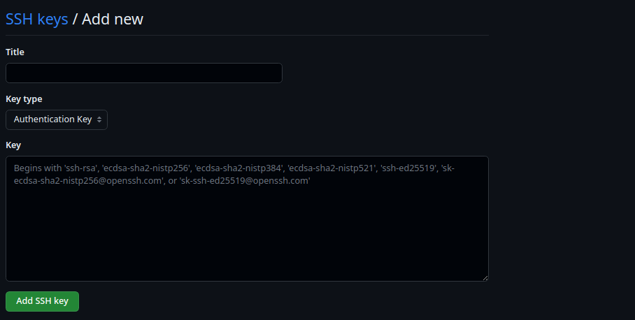
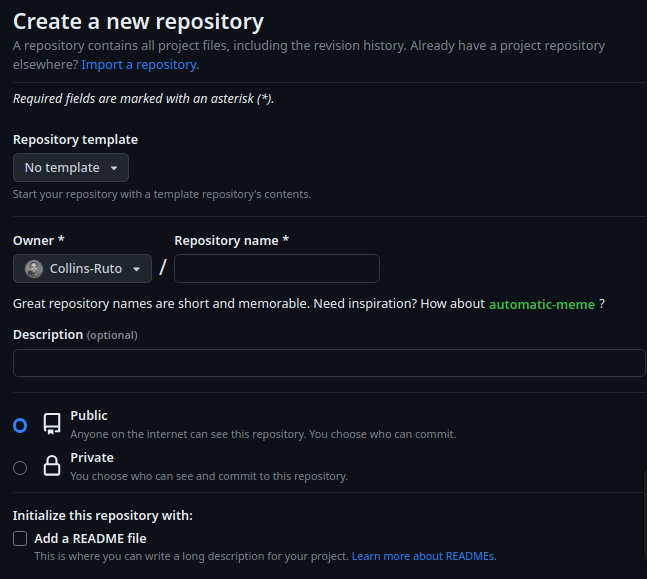
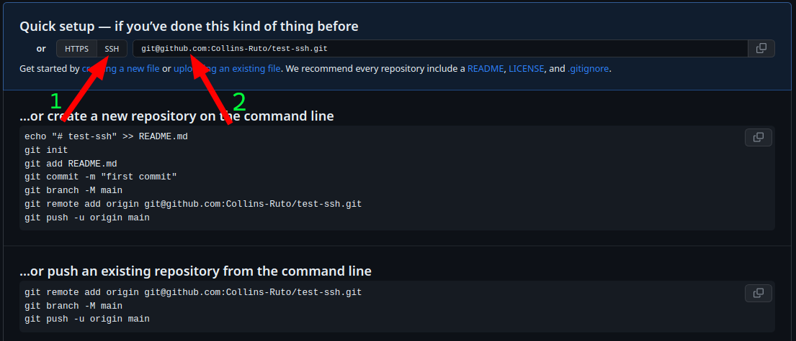

# GitHub SSH for Linux & ALX SandBox

## Introduction

GitHub SSH (Secure Shell) is a secure protocol used to establish a secure encrypted connection between a local machine and GitHub's remote servers. It allows you to securely authenticate and communicate with GitHub without relying github token and also since passwords deprecated and unsuported.

When using SSH with GitHub, you generate a key pair consisting of a public key and a private key. The public key is stored on GitHub, while the private key remains on your local machine. The private key should be kept confidential and protected with a passphrase.

## Sandbox/Terminal setup

To begin, go to your [ALX Sandbox](https://intranet.alxswe.com/user_containers/current) and run your sandbox through your preferred method.

### Generate SSH key

To generate your ssh key, run the following command on your sandbox/terminal.

```
ssh-keygen -t ed25519 -C "your_email@example.com"
```
You will be prompted to Enter a file in which to save the key, press enter to save in the default location. You will then be prompted to enter a passphrase, just press enter or input one and repeat the same if you prefer it.

### Get your SSH key

The generated SSH key is now stored in the `~/.ssh/id_ed25519` directory. To access the new SSH public key, run the command below then select and copy the output.

```
cat ~/.ssh/id_ed25519.pub
```

Copy this value as it is required for later steps in setting up GitHub.
The output should something similar to: 
```
ssh-ed25519 Some-long-string-of-characters-here your-email@gmail.com
```

## GitHub Setup

Now we need to add our generated SSH public key to GitHub account.
Click [here](https://github.com/settings/ssh/new) and you will be directed to your GitHub new SSH Keys page.  
Alternatively, go to your GitHub account settings and navigate to the "SSH and GPG keys" section and click on "New SSH key".
You should see a similar page.  

   

On mobile phones, scroll down to the section.  
On the Title input field, give your ssh key a name e.g "ALX-Sandbox".   
Thereafter on the key input field, paste the public key that we copied from the sandbox output.  
Click Add SSH key.  
You will be prompted to enter you GitHub account password to authorize adding the Key.

## Update your git identity

If you haven't updated your git identity on your sandbox/terminal before, do the following commands and be sure to substitute with your actual username and email:

```
git config --global user.email "you@example.com"
git config --global user.name "Your Name"
```

This helps to create a local git profile for local git commits and activities.

#3 Test

Now that we have successfully added our public key to github, we have to test our connection.  
Open up your sandbox and run the following:

```
ssh -T git@github.com
```
This attempts to connect to GitHub via ssh. If everything is set correctly, it would return something like this:

```
The authenticity of host 'github.com (IP ADDRESS)' can't be established.
ED25519 key fingerprint is SHA256:+....> Are you sure you want to continue connecting (yes/no)?
```

Type `yes` on the terminal to confirm.  
You are now connected!

## Using SSH

Lets try using the new ssh in a real project.  
Firstly create a new repository here: [new empty repository](https://github.com/new) and give a name and optional description.  
Do NOT select add README file, .gitignore or license.  



click on 'create repository'.  

## Cloning the repository

You will be navigated to the created repository page. Click on the ssh tab as shown below arrow 1: 

  

Copy the preceding git ssh url, substituting for your username and the name of your repository. Which in the case of the screenshot above is like so on arrow 2:

```
git@github.com:your-username-here/repo-name-here.git
```

On your terminal/sandbox, clone the repo by running the following, substituting for your username and the name of your repository:

```
git clone git@github.com:your-username-here/repo-name-here.git
```

This should create an empty directory with name repo_name_here inside it. You may now make changes to your project as you wish and push them to GitHub directly. Go to your repository and refresh the page to confirm changes.   

If you are asked to authorize your SSH key after running `git push` as such:  

```
The authenticity of host 'github.com (IP ADDRESS)' can't be established.
ED25519 key fingerprint is SHA256:+....> Are you sure you want to continue connecting (yes/no)?
```

Type `yes` on the terminal to confirm.  
You are now connected and your changes will be pushed.